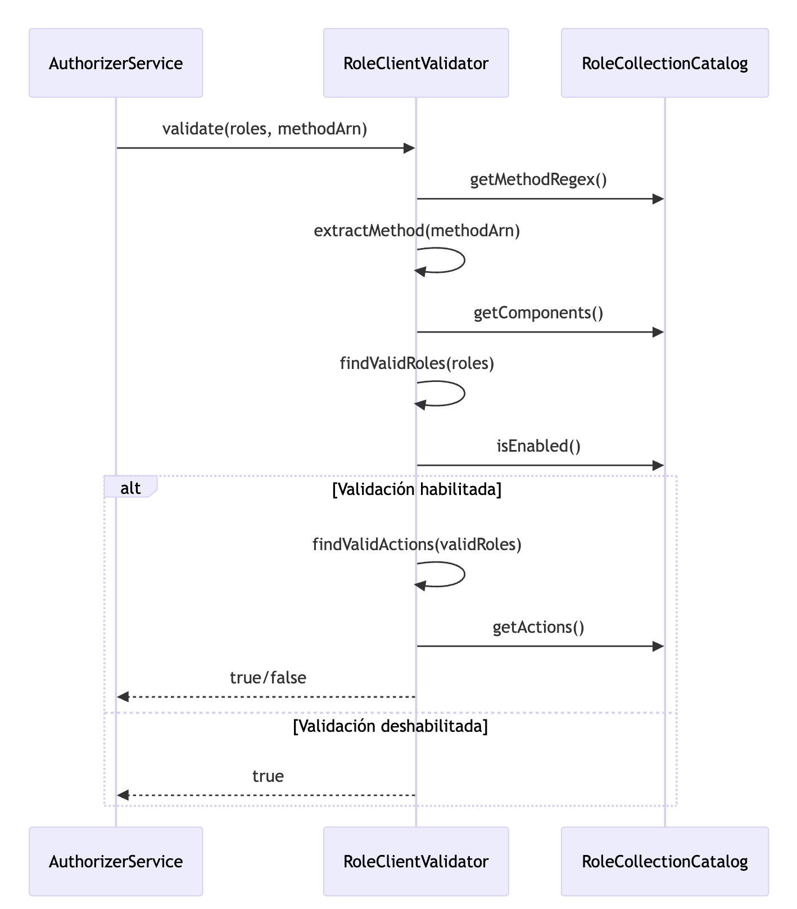
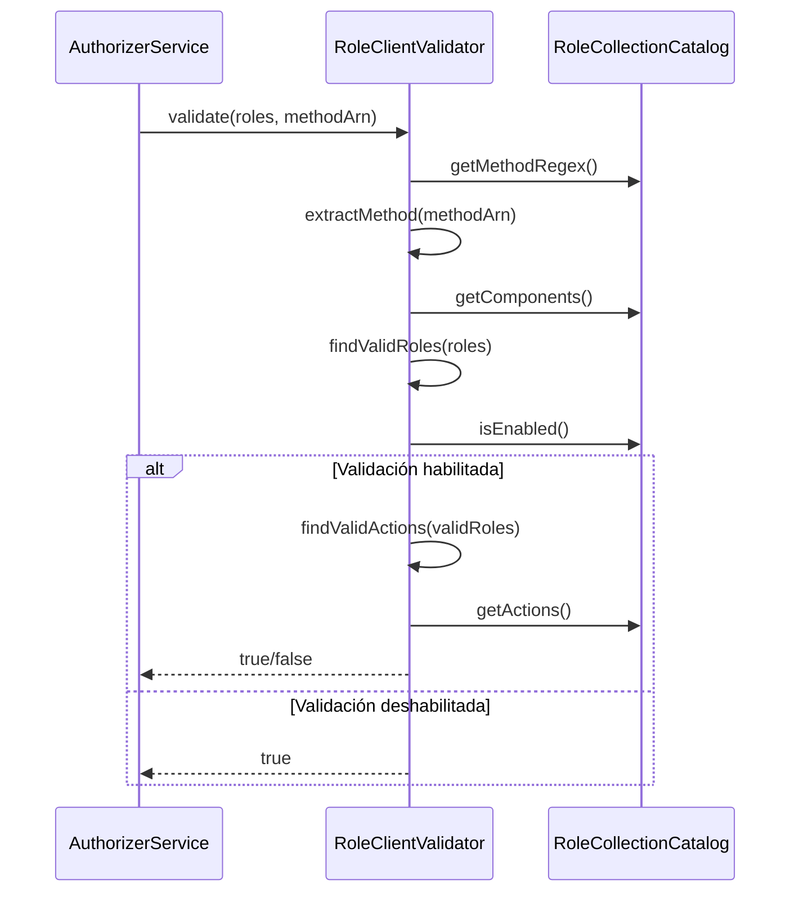
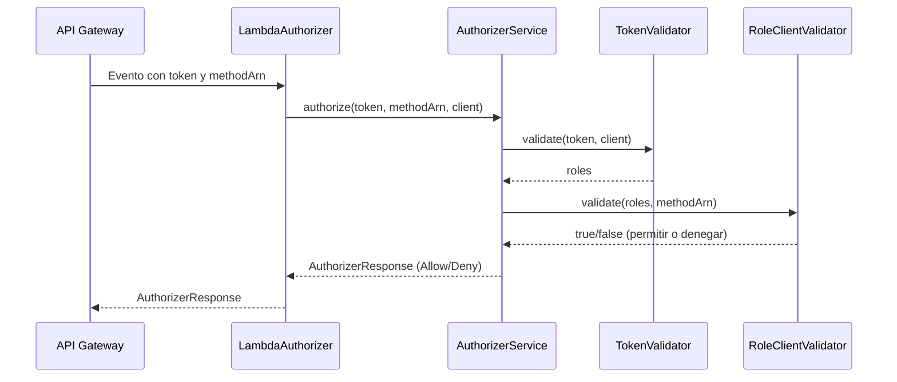
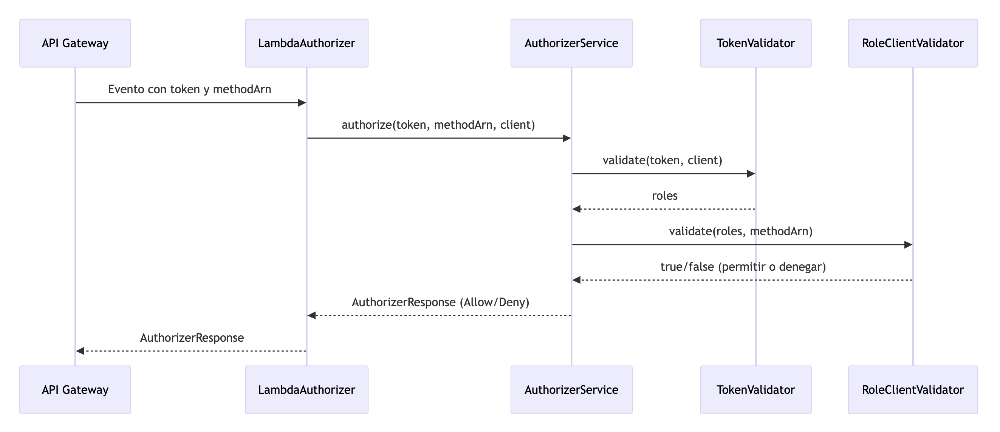

# Lambda Authorizer

## Descripcion.

Esta `Lambda Authorizer` es un componente de seguridad desarrollado en Java 21, usando Gradle y el framework Spring Cloud Function (con el adaptador AWS). Su principal responsabilidad es proteger los endpoints de una API Gateway de AWS, validando el acceso de los usuarios mediante tokens JWT emitidos por `Keycloak`.

### Funcionalidad principal
* Validación de Token:
La lambda recibe un evento de autorización de API Gateway, extrae el token JWT y lo valida contra el endpoint /introspect de Keycloak, asegurándose de que el token esté activo y sea válido.

* Validación de Roles y Permisos:
Una vez validado el token, la lambda verifica que los roles del usuario permitan la acción solicitada (por ejemplo, GET, POST, PUT, DELETE) sobre el recurso, según la configuración definida en los archivos application-<env>.yml.

* Generación de Políticas:
Según el resultado de la validación, la lambda genera una política de acceso (Allow o Deny) que API Gateway utiliza para permitir o rechazar la solicitud.

### Tecnologías clave
* Java 21
* Gradle (con el plugin com.gradleup.shadow para empaquetado)
* Spring Cloud Function Adapter AWS
* Keycloak (para autenticación y autorización centralizada)

## 2. Configuración (application-<env>.yml)
La configuración de roles y Keycloak se define en el archivo de propiedades:

```yml
keycloak:
  base-url: ${BASE_URL_KEYCLOAK}
  clients:
    users:
      client-id: ${CLIENT_IDKEYCLOAK}
      client-secret: ${CLIENT_SECRET_KEYCLOAK}

roles:
  enabled: ${ENABLED_VALIDATION_ROLES}
  method-regex: ${METHOD_REGEX}
  actions:
    post: ${POST_ACTIONS}
    put: ${PUT_ACTIONS}
    delete: ${DELETE_ACTIONS}
    get: ${GET_ACTIONS}
  components: ${LIST_COMPONENTS_ALLOWED}
```
* `keycloak`: Configura la URL base y las credenciales del cliente. El cliente por defecto se llama *users*, sin embargo puede renombrarlo al cliente de su elección.
* `roles.enabled`: Activa o desactiva la validación de roles.
* `roles.method-regex`: Expresión regular para extraer el método HTTP del ARN.
* `roles.actions`: Acciones permitidas por método.
* `roles.components`: Componentes válidos para los roles.

### Inyección de Configuración

La clase [RoleCollectionCatalog](src/main/java/com/transer/authorizer/infrastructure/adapters/outputs/rolevalidators/impl/RoleCollectionCatalog.java) utiliza `@ConfigurationProperties` para mapear la configuración YAML a un bean de Spring.

```java
@Configuration
@ConfigurationProperties(prefix = "roles")
public class RoleCollectionCatalog {
  private boolean enabled;
  private String methodRegex;
  private Map<String, List<String>> actions;
  private List<String> components;
}
```

### Validación de Roles

La clase RoleClientValidator implementa la lógica de validación de roles para autorizar o denegar el acceso a recursos.

```java
@Override
public boolean validate(List<String> roles, String methodArn) {
  final String method = extractMethod(methodArn);
  final List<String> validRoles = findValidRoles(roles);

  if(roleCollectionCatalog.isEnabled()) {

    return findValidActions(validRoles)
      .stream()
      .anyMatch(methodAction -> methodAction.equalsIgnoreCase(method));
  }
  log.info("Role validation is disabled, returning allow policy");
  return true;
}
```

* `extractMethod`: Extrae el método HTTP del ARN usando el regex configurado.
* `findValidRoles`: Filtra los roles que corresponden a los componentes permitidos.
* `findValidActions`: Determina las acciones válidas para los roles filtrados.
* Si la validación de roles está deshabilitada, permite el acceso por defecto.

# Flujo de la Lambda Authorizadora

La clase LambdaAuthorizer implementa `Function<APIGatewayCustomAuthorizerEvent, AuthorizerResponse>.` esto significa que la lambda esta apta para recibir eventos de autorización personalizados de API Gateway (es decir, objetos APIGatewayCustomAuthorizerEvent) y devolver una respuesta de autorización (AuthorizerResponse).

Esto permite que la lambda actúe como un "authorizer" personalizado en AWS API Gateway, evaluando cada solicitud entrante, validando el token y los permisos del usuario, y devolviendo una política (Allow o Deny) que API Gateway usará para permitir o rechazar el acceso al recurso solicitado.

**Entrada**

```java
@Override
public AuthorizerResponse apply(APIGatewayCustomAuthorizerEvent request) {
  log.info("Authorizing request: {}", request);
  final String token = request.getAuthorizationToken();
  final String methodArn = request.getMethodArn();
  return authorizer.authorize(token, methodArn, "users");
}
```

**Servicio de autorización**

La clase [AuthorizerService](src/main/java/com/transer/authorizer/application/services/AuthorizerService.java) orquesta la validación:

- Extrae el token real del header Bearer.
- Llama a [TokenValidator](src/main/java/com/transer/authorizer/application/ports/outputs/TokenValidator.java) para validar el token y obtener los roles.
- Llama a [RoleValidator](src/main/java/com/transer/authorizer/application/ports/outputs/RoleValidator.java) implementado por `RoleClientValidator` para validar los roles contra el ARN.
- Genera una política de acceso (`Allow` o `Deny`) según el resultado.





**3. Respuesta**

Se retorna un objeto [AuthorizerResponse](src/main/java/com/transer/authorizer/domain/models/policies/AuthorizerResponse.java) con la política generada y contexto adicional.

**5. Resumen del flujo**

1. **API Gateway** llama a la Lambda con un evento que contiene el token y el ARN del método.
2. **LambdaAuthorizer** recibe el evento y delega en `AuthorizerService`
3. **AuthorizerService**:
   - Extrae el token.
   - Valida el token con Keycloak y obtiene los roles.
   - Valida los roles contra el método solicitado usando `RoleClientValidator`
   - Retorna una política `Allow` o `Deny`.
4. **API Gateway** aplica la política retornada.





## 🛠️ Build y Ejecución

### Requisitos previos

- Java 21
- Gradle 8.x

### Compilar el proyecto

Para compilar el proyecto y resolver todas las dependencias:

```sh
./gradlew build
```

### Ejecutar los tests

Para correr todos los tests y generar el reporte de cobertura (JaCoCo):

```sh
./gradlew test
```

El reporte de cobertura estará disponible en:  
`build/reports/jacoco/test/html/index.html`

### Generar el Fat Jar (Shadow Jar)

El proyecto utiliza el plugin [`com.gradleup.shadow`](https://plugins.gradle.org/plugin/com.gradleup.shadow) para empaquetar todas las dependencias en un único archivo JAR ejecutable (fat jar), listo para desplegar en AWS Lambda.

Para generar el fat jar:

```sh
./gradlew shadowJar
```

El archivo generado estará en:  
`build/libs/lambda-authorizer-<version>-aws.jar`

> **Nota:**  
> El fat jar generado por `shadowJar` es el que debes subir a AWS Lambda.